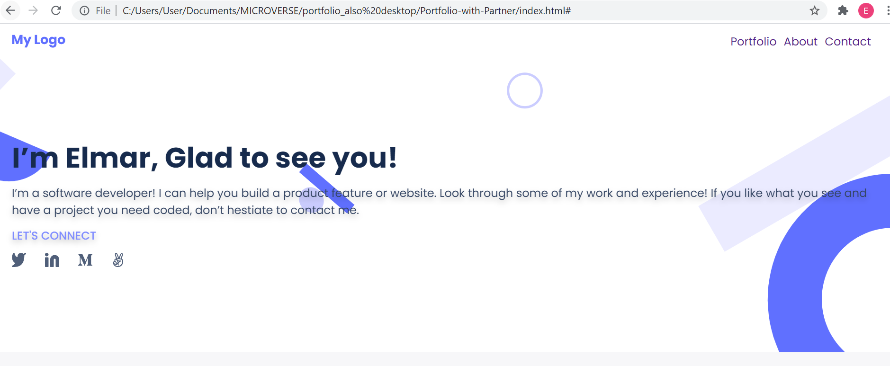

# Software developer portfolio website

* Added mobile menu using JS
* Added validation into contact form with JS
* Added saving data in local storage for contact form with JS
* Added popup window for each card, using data dinamicaly, with JS

## Live demo
You can visit live version via [link](https://elmar8287.github.io/)

## Built With

- HTML/CSS/JS
- Figma
- GH pages

## Author

👤 **Elmar Abdulkarimov**

- GitHub: [@elmar8287](https://github.com/elmar8287)

## 🤝 Contributor

👤 **Sylvestre**

- GitHub: [@pasytchangwa ](https://github.com/pasytchangwa)

## 🤝 Contributing

Contributions, issues, and feature requests are welcome!

Feel free to check the [issues page](../../issues/).

## Show your support

Give a ⭐️ if you like this project!

## Acknowledgments

The project personalized for my  purposes. See the MIT.md file

## 📝 License

This project is [MIT](./MIT.md) licensed.
